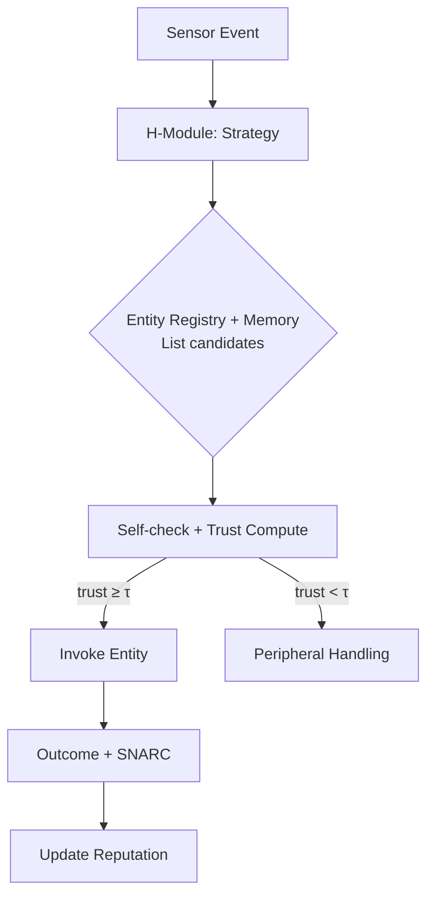

# ENTITY_MEMORY.md — Provenance, Trust Episodes, and Retrieval for SAGE Entities

> Spec for the **Entity Memory** service in SAGE (fractal Web4 instance).  
> Scope: data model, APIs, trust/reputation math, retrieval hooks, mailbox integration, and sleep/dream consolidation.

---

## 1) Purpose

**Entity Memory** is SAGE’s persistent knowledge base about **entities** (sensors, effectors, both) and their **roles** (e.g., “dictionary”). It stores:
- **Provenance & metadata** (who/what produced the entity, versions, hashes, device prefs)
- **Availability** (installed vs retrievable; location URIs; sidecar fetch strategy)
- **Trust episodes** (context → use → outcome → SNARC signals)
- **Reputation** (learned utility across contexts, with decay & uncertainty)
- **Policies & caps** (max trust contribution, safe modes, domain boundaries)

It powers runtime **selection**, **trust gating**, and **post-hoc learning**.

---

## 2) Concepts & Identity

- **Entity** — active module with ID (stable UID), role(s), and interfaces (domains-in/out).
- **Role** — label(s) describing function: `sensor`, `effector`, `dictionary`, `bridge`, `cognitive_sensor`, etc.
- **Context** — features that condition success: language, sample rate, tokenizer hash, device, environment profile, user/task class.
- **Episode** — a single attempt to use an entity (or pipeline) in a specific context with measured outcome.
- **Reputation** — statistical summary aggregating episodes across similar contexts.

**ID format** (suggested):
```
entity:<namespace>/<name>@<version>#<build-hash>
e.g., entity:asr/openen@1.3#9b1a4f3
```
Aliases and “latest” tags can resolve to concrete IDs via provenance index.

---

## 3) Data Model (JSON-like schema)

### 3.1 Entity Record

```jsonc
{
  "id": "entity:asr/openen@1.3#9b1a4f3",
  "roles": ["sensor", "effector", "dictionary"],
  "domain_in":  ["audio/pcm@16k"],
  "domain_out": ["text/en"],
  "provenance": {
    "source_repo": "https://...",
    "commit": "9b1a4f3",
    "signer": "ed25519:...",
    "license": "Apache-2.0",
    "build": {"toolchain": "cuda-12.2", "arch": "sm_87"}
  },
  "context_defaults": {
    "language": "en",
    "vad": true,
    "expected_sr": 16000
  },
  "device_pref": {"primary": "gpu", "fallback": "cpu"},
  "footprint_mb": 740,
  "trust_cap": 0.92,
  "availability": {
    "installed": true,
    "location": "file:///opt/sage/entities/asr/openen-1.3.bin",
    "retrieval": {
      "mirror": ["s3://...", "ipfs://...", "https://..."],
      "sidecar": "entity:retriever/sidecar@0.5#8a7c1",
      "checksum": "sha256:..."
    }
  },
  "reputation": {
    "global": {"mean": 0.81, "n": 124, "var": 0.03, "last_seen": "2025-08-17T15:42:09Z"},
    "by_context_key": {
      "audio@16k|lang=en": {"mean": 0.86, "n": 88, "var": 0.02, "decay_ts": "2025-08-17T10:00:00Z"}
    }
  },
  "notes": "ASR English; strong on clean speech; weaker on accented/noisy input."
}
```

### 3.2 Episode Record

```jsonc
{
  "episode_id": "ep:2025-08-17T15:38:22Z:7f1e",
  "entity_id": "entity:asr/openen@1.3#9b1a4f3",
  "pipeline_id": "pipe:audio->asr->tok->llm",
  "ts": "2025-08-17T15:38:22Z",
  "context": {
    "sr": 16000,
    "lang_hint": "en",
    "noise_db": 24.1,
    "task": "qa",
    "device": "gpu",
    "tokenizer_hash": "abc123"
  },
  "self_check": {"ok": true, "conf": 0.89, "reason": "domain match"},
  "use": {"duration_ms": 71, "bytes_in": 128000, "bytes_out": 420},
  "outcome": {
    "coherence": 0.78,
    "user_ack": 1.0,
    "latency_ms": 95
  },
  "snarc": {"surprise": 0.1, "novelty": 0.3, "arousal": 0.2, "reward": 0.9, "conflict": 0.1},
  "trust_delta": +0.03,
  "comments": "Clear speech; downstream answer accepted; low conflict with vision."
}
```

### 3.3 Retrieval Record (Sidecar)

```jsonc
{
  "entity_id": "entity:asr/openen@1.3#9b1a4f3",
  "available": false,
  "preferred_mirror": "ipfs://...",
  "sidecar_state": {"last_attempt": "2025-08-17T12:12:12Z", "status": "not_found"},
  "install_plan": [
    {"op": "fetch", "uri": "ipfs://...", "hash": "sha256:..."},
    {"op": "verify", "hash": "sha256:..."},
    {"op": "place", "path": "/opt/sage/entities/asr/openen-1.3.bin"}
  ]
}
```

---

## 4) Trust & Reputation Math

### 4.1 Context Keying
Define a **context key** function to cluster similar contexts, e.g.:
```
ctx_key = f"audio@{sr}|lang={lang}|tok={tokenizer_hash[:6]}"
```
(Use hashing + bucketing to avoid explosion.)

### 4.2 Running Statistics
Maintain **mean/var/n** with exponential decay:
```
mean_t = (1 - α) * mean_{t-1} + α * score_t
var_t  = (1 - α) * var_{t-1}  + α * (score_t - mean_t)^2
n_t    = (1 - β) * n_{t-1} + 1        # β controls memory of sample count
```
Where `score_t` is derived from outcomes (coherence, reward, latency) and SNARC weights.

### 4.3 Trust Computation
At runtime:
```
trust(entity, ctx) = clamp(
  w0 * prior_global +
  w1 * prior_ctx(ctx_key) +
  w2 * self_check_conf +
  w3 * policy_cap(entity.trust_cap) -
  w4 * conflict_penalty -
  w5 * staleness_penalty(last_seen),
  0, entity.trust_cap)
```
- `prior_global` = reputation.global.mean (uncertainty via var/n)
- `prior_ctx` = reputation.by_context_key[ctx_key].mean (if present)
- `self_check_conf` from entity’s `self_check()`
- conflict/staleness penalties reduce trust fast when applicable

SNARC-derived **score** example:
```
score = 0.5*reward + 0.3*coherence - 0.2*conflict
```

---

## 5) APIs (Sketch)

### 5.1 CRUD & Query

```python
class EntityMemory:
    def upsert_entity(self, record: dict) -> None: ...
    def get_entity(self, entity_id: str) -> dict | None: ...
    def search(self, role=None, domain_in=None, domain_out=None, text=None) -> list[dict]: ...
    def mark_installed(self, entity_id: str, location: str) -> None: ...
    def record_episode(self, episode: dict) -> None: ...
    def update_reputation(self, entity_id: str, ctx_key: str, score: float, ts: str) -> None: ...
    def get_reputation(self, entity_id: str, ctx_key: str|None=None) -> dict: ...
    def list_candidates(self, domain_in: str, context: dict) -> list[str]: ...
    def get_retrieval_plan(self, entity_id: str) -> dict: ...
```

### 5.2 Runtime Helpers

```python
def compute_trust(entity: dict, context: dict, self_conf: float) -> float: ...
def choose_entity(memory: EntityMemory, domain_in: str, context: dict, k=3) -> list[dict]: ...
def record_outcome(memory: EntityMemory, entity_id: str, episode: dict) -> None: ...
```

### 5.3 Storage Backends
- **Lightweight**: SQLite/DuckDB + JSONB-like columns (portable, easy to ship)
- **Embedded KV**: RocksDB/LMDB for low-latency lookup on Jetson
- **Cloud**: Postgres/ClickHouse for fleet-scale analytics

Index on: `id`, `roles[]`, `domain_in`, `domain_out`, `ctx_key`, `provenance.commit`, `availability.installed`.

---

## 6) Mailbox Integration

### 6.1 Peripheral Broadcast Examples
```jsonc
{"kind":"entity_heartbeat","id":"entity:asr/openen@1.3#9b1a4f3","device":"gpu","healthy":true}
{"kind":"entity_missing","id":"entity:asr/openen@1.3#9b1a4f3","reason":"not_installed"}
{"kind":"episode_result","entity":"entity:asr/openen@1.3#9b1a4f3","score":0.83,"ctx_key":"audio@16k|lang=en"}
```

### 6.2 Focus Mailbox Example
```jsonc
{
  "kind": "entity_output",
  "entity": "entity:asr/openen@1.3#9b1a4f3",
  "payload_ptr": "0x7f12...",
  "meta": {"domain":"text/en","conf":0.86,"ctx_key":"audio@16k|lang=en","ts":"..."},
  "monitor": {"latency_ms": 92}
}
```

The **Entity Memory** service subscribes to these and updates reputation online.

---

## 7) Sleep/Dream Consolidation

During sleep:
1. **Mine episodes** in the last horizon (e.g., 6h).  
2. **Augment contexts** (noise, accents, paraphrases).  
3. **Simulate/Replay** with stored entities (or surrogates) to obtain synthetic outcomes.  
4. **Update reputation** with appropriate **lower weight** for synthetic data.  
5. **Prune/Decay** stale reputations and promote entities with consistent high scores.  

This yields **trust curves** that generalize beyond specific episodes.

---

## 8) Security & Integrity

- **Provenance attestation**: signatures for entity bundles; verify on install.  
- **Policy caps**: hard limits on trust; “sandbox-only” entities cannot escalate.  
- **Quarantine on anomaly**: large conflict spikes → isolate and require manual review.  
- **Reproducibility**: store build toolchain and hash; annotate episodes with env hash.  

---

## 9) Performance & Footprint (Jetson-first)

- Keep **hot indices** (id → minimal record) in RAM.  
- Store **large notes/reputations** in compressed columns; lazy load.  
- Batch **episode writes**; compact periodically.  
- Precompute **ctx_key** and decay asynchronously.  
- Expose **read-only snapshot** to H/L modules to avoid lock contention.

---

## 10) Mermaid Diagrams

### 10.1 Data Flow (Runtime)



### 10.2 Sleep Consolidation

```mermaid
flowchart TD
  M[Recent Episodes] --> AUG[Augment Contexts]
  AUG --> REPLAY[Replay/Simulate Pipelines]
  REPLAY --> UPDATE[Update Reputation (low weight)]
  UPDATE --> DECAY[Decay + Prune Stale Entries]
  DECAY --> SNAP[Write Snapshot for Next Day]
```

---

## 11) Example: Entity Records (Dictionaries)

- **ASR (Audio→Text/en)** — high GPU footprint, conf depends on noise profile.  
- **Tokenizer (Text→Tokens/llama3)** — low footprint, `tokenizer_hash` must match.  
- **Bridge (Tokens/llama3→Tokens/mistral)** — two modes (safe via text, fast via direct map), reports coverage/confidence.  
- **TTS (Text/en→Audio)** — GPU preferred, latency tracked for real-time thresholds.

Each emits **heartbeats**, **self-check** results, and **episode outcomes** to feed Entity Memory.

---

## 12) Minimal Pseudocode (Python-ish)

```python
class EntityMemory:
    def __init__(self, store): self.store = store

    def ctx_key(self, ctx: dict) -> str:
        sr = ctx.get("sr", "na")
        lang = ctx.get("lang", "na")
        tok = (ctx.get("tokenizer_hash") or "na")[:6]
        return f"audio@{sr}|lang={lang}|tok={tok}"

    def compute_trust(self, ent: dict, ctx: dict, self_conf: float) -> float:
        ck = self.ctx_key(ctx)
        rep_g = ent["reputation"]["global"]["mean"]
        rep_c = ent["reputation"]["by_context_key"].get(ck, {}).get("mean", rep_g*0.9)
        last = ent["reputation"]["global"].get("last_seen")
        staleness = 0.0  # compute from ts(last) if available
        trust = (0.25*rep_g + 0.45*rep_c + 0.25*self_conf - 0.1*staleness)
        return max(0.0, min(trust, ent.get("trust_cap", 1.0)))

    def record_episode(self, ep: dict) -> None:
        self.store.write("episodes", ep["episode_id"], ep)
        score = 0.5*ep["snarc"]["reward"] + 0.3*ep["outcome"]["coherence"] - 0.2*ep["snarc"]["conflict"]
        self.update_reputation(ep["entity_id"], self.ctx_key(ep["context"]), score, ep["ts"])
```

---

## 13) Deliverables & Next Steps

- ✅ **Spec** (this document)  
- ⏳ **Stub implementation**: SQLite or DuckDB-based store with indexes; mailbox subscribers to ingest outcomes.  
- ⏳ **Integration hooks**: Registry → Memory calls during entity selection; sleep pipeline consumption.  
- ⏳ **Telemetry**: Grafana/Prometheus-like counters for entity outcomes and trust curves.

---

**End of spec.**