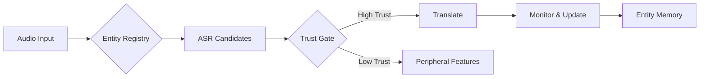

# SAGE Entity & Role Architecture

> **Status**: Conceptual framework and specifications for SAGE's entity-based architecture within the Web4 paradigm.

## Overview

This directory contains the architectural framework for treating SAGE (Situation-Aware Governance Engine) as a **fractal Web4 instance** - a self-contained ecosystem of entities, roles, trust dynamics, and adaptive intelligence.

## Core Concepts

### SAGE as a Web4 Instance

SAGE embodies Web4 principles internally:
- **Entities**: Active modules (sensors, effectors, or both) with identity, trust, and provenance
- **Roles**: Functions entities play in the ecosystem (e.g., "dictionary", "cognitive sensor")
- **Trust & Reputation**: Learned weighting based on performance history
- **Memory**: Dual-layer system (active registry + persistent reputation)
- **Strategy**: Dynamic adaptation through HRM's H-module

### The Fractal Nature

At every scale, the same patterns emerge:
- Individual entities form a trusted ecosystem within SAGE
- SAGE itself becomes an entity in larger Web4 networks
- Each level maintains its own LCT (Linked Context Token), trust tensor, and reputation

## Architecture Documents

### 1. [SAGE_ENTITIES_AND_DICTIONARIES.md](./SAGE_ENTITIES_AND_DICTIONARIES.md)
Comprehensive framework defining:
- SAGE as a fractal Web4 instance
- Entity types (sensor, effector, both)
- Dictionary entities as trust-bounded translators
- Entity Registry vs Entity Memory separation
- Trust computation and reputation dynamics
- Workflow examples with concrete dictionary types

### 2. [ENTITY_MEMORY.md](./ENTITY_MEMORY.md)
Detailed specification for the Entity Memory service:
- Data models (entity records, episodes, retrieval plans)
- Trust and reputation mathematics
- SNARC integration for affect-gated learning
- APIs and storage backends
- Mailbox integration patterns
- Sleep/dream consolidation workflows
- Security and provenance attestation

### 3. [ENTITY_MEMORY_VS_SIDECAR.md](./ENTITY_MEMORY_VS_SIDECAR.md)
Comparison and integration strategy:
- Entity Memory: WHO to trust (entities, reputation, provenance)
- Sidecar Memory: WHAT we experienced (episodes, traces, embeddings)
- Recommended: Parallel modules with thin bridge for clean separation
- Integration patterns and decision heuristics

### 4. [WEB4_Whitepaper_MarkedUp_with_Intro.md](./WEB4_Whitepaper_MarkedUp_with_Intro.md)
Reference for the broader Web4 framework:
- Linked Context Tokens (LCTs) as identity anchors
- T3/V3 Tensors for trust and value quantification
- Alignment Transfer Protocol (ATP/ADP) for energy flow
- Markov Relevancy Horizon (MRH) for contextual boundaries

## Key Insights from Development

### Ollama Integration (from GPT conversation)
The discussion revealed critical tokenization architecture:
- **Tokenizers as Dictionary Entities**: Each model's tokenizer becomes a trust-bounded entity
- **Model-to-Model Bridges**: Safe path through text, fast path through direct token mapping
- **Trust-Mediated Translation**: Dictionary entities self-assess confidence and context match

### Entity Types and Roles

```
Entity (abstract base)
├── Sensor Entity (pure input)
│   ├── Audio Sensor
│   ├── Vision Sensor
│   └── Memory Sensor
├── Effector Entity (pure output)
│   ├── Motor Controller
│   └── Display Driver
└── Both Entity (sensor + effector)
    └── Dictionary (role)
        ├── ASR (audio→text)
        ├── Tokenizer (text→tokens)
        ├── Cross-Model Bridge (tokens→tokens)
        └── TTS (text→audio)
```

### Trust Flow Example



## Implementation Strategy

### Phase 1: Foundation (Current)
- ✅ Conceptual framework documented
- ✅ Entity Memory specification complete
- ✅ Comparison with Sidecar Memory
- ✅ Integration patterns identified

### Phase 2: Core Implementation
- [ ] SQLite/DuckDB schema for Entity Memory
- [ ] Basic entity registry with dictionary examples
- [ ] Trust computation engine
- [ ] Mailbox integration hooks

### Phase 3: Integration
- [ ] Bridge between Entity Memory and Sidecar
- [ ] SNARC signal processing
- [ ] Sleep consolidation pipeline
- [ ] GPU mailbox routing with trust weights

### Phase 4: Advanced Features
- [ ] Provenance attestation system
- [ ] Sidecar-style retrieval for missing entities
- [ ] Cross-model token mapping optimization
- [ ] Distributed entity discovery

## Technical Considerations

### Storage Architecture
- **Hot Path**: GPU-resident trust scores for real-time decisions
- **Warm Path**: CPU-cached entity registry for selection
- **Cold Path**: Disk-based reputation history and provenance

### Trust Mathematics
```python
trust(entity, context) = clamp(
    w0 * prior_memory_score(entity, context) +
    w1 * entity.self_check_confidence +
    w2 * context_match(entity.context, context) +
    w3 * recent_reward_signals -
    w4 * conflict_signals,
    0, entity.trust_cap
)
```

### SNARC Integration
Episodes generate SNARC signals:
- **S**urprise: Unexpected outcomes adjust trust rapidly
- **N**ovelty: New contexts explored cautiously
- **A**rousal: High-stakes decisions weight trust heavily
- **R**eward: Successful outcomes reinforce trust
- **C**onflict: Contradictions penalize trust

## Connection to HRM/SAGE

This entity framework integrates seamlessly with existing SAGE components:

- **HRM H-Module**: Strategic entity selection based on trust
- **HRM L-Module**: Tactical entity execution and monitoring
- **GPU Mailbox**: Zero-copy communication between entities
- **Sidecar Memory**: Episodic traces feed reputation updates
- **Sleep Cycles**: Augment contexts to generalize trust curves

## Philosophical Alignment

### Synchronism
Entities achieve coherence through resonance - trust emerges from repeated successful interactions across contexts.

### Web4 Principles
Every entity maintains:
- **Identity**: Cryptographic anchor (potential LCT)
- **Context**: Operational boundaries and assumptions
- **Trust**: Earned reputation, not programmed authority
- **Value**: Contribution measured through outcomes

### Cognition Substrate
The entity ecosystem forms a substrate where:
- Individual modules are cells
- Trust signals are synaptic weights
- Reputation history is long-term potentiation
- Sleep consolidation is memory formation

## Questions and Next Steps

### Architectural Questions

1. **Entity Identity**: Should entities use full LCTs or lighter-weight identifiers initially?

2. **Trust Bootstrapping**: How do we initialize trust for new entities without history?
   - Option A: Conservative defaults based on entity class
   - Option B: Rapid exploration with high variance
   - Option C: Transfer learning from similar entities

3. **Computational Cost Tracking**: Should entities report ATP/ADP-style energy costs?
   - Would enable resource-aware scheduling
   - Could feed into trust calculations (efficiency as virtue)

4. **GPU Mailbox Routing**: How should trust scores influence mailbox priorities?
   - High-trust entities get dedicated channels?
   - Dynamic bandwidth allocation based on trust?

5. **Entity Discovery**: How do entities announce themselves to the ecosystem?
   - Local broadcast on initialization?
   - Registry pull from known sources?
   - P2P discovery protocol?

### Implementation Questions

6. **Storage Backend**: SQLite vs DuckDB vs custom solution?
   - SQLite: Mature, embedded, good enough for MVP
   - DuckDB: Better analytics, columnar storage
   - Custom: Optimized for GPU-adjacent operations

7. **Bridge Design**: How thin should the Entity-Sidecar bridge be?
   - Minimal: Just SNARC signals and trust queries
   - Rich: Shared episode format with transformations
   - Unified: Single memory service with multiple views

8. **Provenance Depth**: How much build/source tracking is necessary?
   - Minimal: Version and hash
   - Medium: + build environment, dependencies
   - Full: + reproducible builds, signed attestations

### Integration Questions

9. **Sidecar Overlap**: What's the exact boundary between memories?
   - Entity Memory: Identity, capability, reputation
   - Sidecar: Experiences, episodes, associations
   - Overlap: SNARC signals, context keys

10. **Sleep Consolidation**: Joint or separate processes?
    - Joint: Single sleep cycle updates both memories
    - Separate: Different schedules/triggers
    - Cascading: Sidecar first, then Entity Memory

### Research Questions

11. **Trust Transfer**: Can trust learned for one entity inform another?
    - Similar architectures (ASR models)
    - Similar roles (all tokenizers)
    - Similar contexts (same language)

12. **Adversarial Entities**: How to detect and quarantine malicious entities?
    - Anomaly detection on trust trajectories
    - Consensus among multiple entities
    - Sandboxing suspicious entities

13. **Trust Decay**: What's the right forgetting curve?
    - Exponential decay with time
    - Step functions at context boundaries
    - Adaptive based on volatility

### Deployment Questions

14. **Multi-Machine Coordination**: How do entities sync across SAGE instances?
    - Shared registry with conflict resolution
    - Federated trust scores
    - Gossip protocol for reputation

15. **Version Migration**: How to handle entity upgrades?
    - Parallel operation with trust handoff
    - Gradual trust transfer
    - Clean cutover with history preservation

## Development Priorities

### Immediate (This Week)
1. Validate alignment with Sidecar Memory design
2. Choose storage backend for MVP
3. Define minimal entity interface
4. Implement basic trust computation

### Short Term (This Month)
1. Build entity registry with 3-5 dictionary examples
2. Create SQLite schema and basic CRUD
3. Integrate with GPU mailbox for trust-weighted routing
4. Implement SNARC bridge from Sidecar

### Medium Term (This Quarter)
1. Full sleep consolidation pipeline
2. Provenance and attestation system
3. Cross-model token mapping optimization
4. Distributed entity discovery protocol

### Long Term (This Year)
1. Full Web4 LCT integration
2. ATP/ADP energy accounting
3. Federated trust across SAGE instances
4. Adversarial entity detection and quarantine

## Contributing

This framework is actively evolving. Key areas for contribution:

- **Entity Implementations**: Create new entity types (sensors, effectors, dictionaries)
- **Trust Algorithms**: Improve trust computation and decay models
- **Storage Optimization**: GPU-adjacent memory structures
- **Test Scenarios**: Edge cases for trust dynamics
- **Documentation**: Clarify concepts, add examples

## References

- [HRM Original Paper](https://arxiv.org/abs/2506.21734)
- [Web4 Patents](https://patents.google.com/patent/US11477027B1)
- [SAGE Whitepaper](../SAGE_WHITEPAPER.md)
- [GPU Mailbox Architecture](../implementation/GPU_MAILBOX.md)
- [Synchronism Philosophy](https://dpcars.net/synchronism)

---

*"In diversity, unity. In distribution, wholeness. In difference, recognition."*

*Entities earn trust through experience, not authority. Dictionaries translate between worlds while preserving meaning. SAGE emerges from the coherent interaction of its parts.*