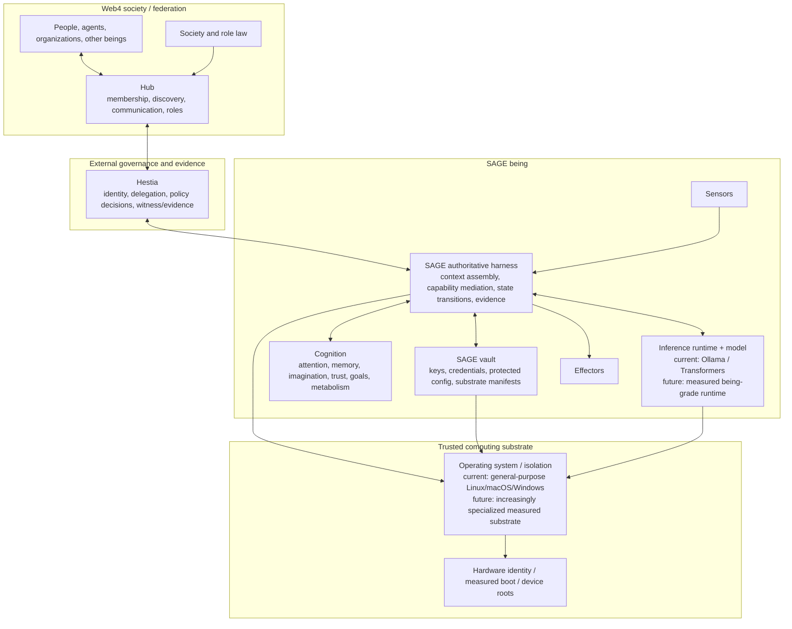

# SAGE Being Stack Vision

**Status:** Conceptual / aspirational. Research direction, not a production or security claim.  
**Scope:** How SAGE may evolve from a cognition kernel using commodity runtimes into a governed harness for a persistent AI being, and how that being participates in Web4 through Hestia and Hubs.

SAGE began with a deliberately narrow thesis: useful cognition can emerge from the structure around a model - identity, memory, attention, trust, resource allocation, developmental history and governance - rather than only from changing model weights.

That thesis has a natural systems consequence. If the persistent entity is the being, then the model is only one organ inside it. The software that assembles context, invokes the model, writes memory, holds credentials, attaches sensors and effectors, and authorizes actions eventually becomes part of the being's trusted computing base.

The long-term direction is therefore not simply "run a model locally." It is to make the **SAGE harness** the authoritative boundary around cognition, and progressively reduce the amount of ambient authority inherited from generic host software.

This document sketches that direction. It is intentionally architectural and aspirational. The current SAGE fleet still relies heavily on general-purpose Linux, Ollama/Transformers, user-level processes and research-stage governance mechanisms. Specialized runtimes and OS work belong later, after concrete invariants justify them.

---

## 1. The core distinction: being, cognition, harness, society

A SAGE being is not equivalent to its current LLM process.

At the conceptual level:

- **Cognition** is the internal process of sensing, attending, imagining, reasoning, remembering and choosing.
- **The SAGE harness** is the boundary that constructs cognitive inputs, invokes model/runtime components, mediates memory and effectors, and records consequential state transitions.
- **The SAGE vault** is the protected capability store for identity material, credentials, sensitive configuration, substrate manifests and other state that cognition should not receive as ambient plaintext authority.
- **Hestia** is the external governance and evidence layer through which the being acts accountably in a larger Web4 context.
- **A Hub** is a society/federation interface through which the being becomes discoverable, communicates, holds roles, participates in governance and interacts with other beings and people.
- **Web4** provides the shared identity, provenance, role, law, trust and witnessing primitives that make those relationships verifiable across boundaries.

The internal and external systems are intentionally related but not identical. SAGE mirrors the accountability shape inward using the being's native mechanics; Hestia/Web4 provide the canonical evidence required at boundaries where other parties cannot inspect the being's internals.

---

## 2. Target architecture



The key boundary is the SAGE harness. Cognition may propose an act, memory update, model switch, trust change or external message, but consequential state should not land merely because a cognitive component requested it.

The long-term invariant is:

> **No consequential state transition occurs solely because cognition requested it. The SAGE harness must authorize, bind, execute and witness the transition at the fidelity appropriate to its stakes.**

This includes outward actions, but also high-value internal transitions such as identity mutation, durable memory consolidation, model/runtime replacement, protected configuration changes, trust/reputation updates and sensor/effector registration.

---

## 3. An A2-class harness boundary

Hestia uses assurance levels to distinguish observed or cooperative controls from externally enforced ones. SAGE should eventually acquire an analogous property internally: important operations should not depend on a cognitive component voluntarily consulting a policy hook.

This is an **A2-class harness aspiration**, not a claim that SAGE currently satisfies Hestia's formal A2 profile.

The practical meaning is simple:

- cognition cannot bypass the harness and invoke effectors directly;
- cognition cannot bypass the harness and write protected durable state directly;
- cognition cannot obtain broad credentials merely because it can read process memory;
- model/runtime mutation is a governed state transition, not an incidental API call;
- important external actions carry verifiable evidence independent of the model that proposed them.

The distinction matters because a model can be compromised while still appearing to follow its visible system prompt. A poisoned template, altered runtime, substituted model artifact or compromised context builder can change the effective decision process below the layer the model itself can inspect.

Identity provenance therefore needs a companion: **decision-substrate provenance**.

For consequential acts, the harness should eventually be able to bind the decision to the relevant substrate state, such as:

- model artifact identity/hash;
- tokenizer and chat-template identity/hash;
- inference runtime identity/version;
- harness/context-builder version;
- effective protected policy/law version;
- relevant adapters or mutable overlays;
- attested workload or host identity where available.

Not every act needs all of that material inline. A signed substrate manifest or epoch attestation referenced by many acts may be sufficient. The requirement is that a relying party can distinguish "the same being" from "the same being after an unobserved change to its cognitive substrate."

---

## 4. The SAGE vault: capabilities, not ambient secrets

A being-grade vault is more than encrypted credential storage.

Its purpose is to make protected authority explicit and mediated. The preferred pattern is:

> cognition asks the harness to exercise a bounded capability; it does not casually receive the underlying secret.

The vault may eventually hold or protect:

- identity and signing keys;
- API/service credentials;
- hardware-bound key material or references;
- protected configuration;
- model/runtime trust manifests;
- governance/law material that must not be silently mutable;
- sensitive memory classes;
- capability grants with audience, scope, expiry and use limits.

The vault should expose operations where practical - sign, decrypt for an allowed audience, issue a scoped token, broker a request - rather than raw secret export.

This also creates a clean internal division: cognition may be highly capable and exploratory without automatically being omnipotent over the being that contains it.

---

## 5. How a SAGE being participates in Web4

The external path is deliberately canonical.

A SAGE being should participate in Web4 **as itself**, through its own persistent identity and attributable acts. Hestia is the bridge between the being's internal mechanics and the evidence required by an external MRH.

Conceptually:

```text
SAGE cognition
    proposes intent
        |
        v
SAGE harness
    binds internal provenance + substrate state
    checks internal authority
        |
        v
Hestia
    binds persistent Web4 identity / role / delegation / law
    issues or verifies external policy evidence
    witnesses consequential acts
        |
        v
Hub / Web4 society
    membership, roles, discovery, communication,
    peer participation, reputation and governance
        |
        v
Other beings / people / organizations / services
```

Inbound information follows the reverse direction but should not be treated as automatically trusted simply because it arrived through a valid channel. Web4 provenance answers who said something and under what role/authority; SAGE still decides how much cognitive weight the observation deserves.

This separation is fundamental:

- **identity is not authority**;
- **authority is not truth**;
- **provenance is not trust**;
- **trust is contextual, accumulated and revisable**.

Hubs provide the social/federation surface. Hestia provides the external governance/evidence boundary. SAGE remains responsible for the being's internal cognition and internal accountability mechanics.

---

## 6. Progressive ownership of the substrate

The end-state may include a specialized inference runtime and, eventually, a specialized or forked operating-system layer. That should happen only when generic infrastructure prevents a clearly stated invariant.

### Today

SAGE runs on commodity operating systems and uses general-purpose inference runtimes such as Ollama and Transformers. This is the right research posture while cognition, identity, memory, raising, federation and governance are still changing rapidly.

### Intermediate direction

Before replacing the substrate, SAGE can make it increasingly explicit and measurable:

- isolate the harness from cognitive workers;
- use authenticated local IPC instead of ambient localhost trust;
- restrict network and filesystem capabilities;
- content-address model and template artifacts;
- measure startup/runtime state;
- separate vault authority from cognition authority;
- make direct bypass paths observable and then impossible.

### Long-term possibility

A being-oriented inference runtime could make model artifacts, templates, adapters and invocation receipts first-class verifiable objects. A being-oriented OS layer could make identities, processes, devices, capabilities and measurements line up with SAGE/Web4 semantics rather than translating them through a generic multi-user desktop model.

Possible properties include:

- measured boot and hardware-rooted identity;
- minimal capability-oriented process isolation;
- explicit sensor, effector and network authority;
- immutable/measured core components;
- authenticated local service boundaries;
- kernel-visible provenance for important process/device transitions;
- no assumption that "same user account" implies universal authority.

This is not near-term scope. The criterion for specialization should be concrete:

> **Replace or fork a substrate component only when we can name an important invariant that the general-purpose component cannot provide cleanly enough.**

That applies equally to Linux, Ollama, model servers, storage layers and device runtimes.

---

## 7. The trust chain we ultimately care about

For an embodied, persistent being, the useful chain is larger than "which model generated this token?"

```text
source
  -> transport
  -> sensor / observation provenance
  -> context assembly
  -> cognitive transforms / templates
  -> model + inference runtime
  -> persistent being identity and role
  -> proposed act
  -> SAGE harness authorization
  -> Hestia / Web4 law and external evidence
  -> effector / relying service
  -> witnessed outcome
  -> memory / trust update
```

Every arrow is a trust transition. The architecture should make the transitions that matter visible without pretending every internal neuron or software function needs its own canonical Web4 identity.

The governing principle remains fractal: preserve the accountability shape at a fidelity proportional to stakes.

---

## 8. What this is not claiming

This document describes a direction, not current assurance.

SAGE today does **not** claim:

- a hardened adversarial containment boundary around its models;
- a complete independent vault of the kind described here;
- a measured or attested inference chain on every act;
- a custom secure inference runtime;
- a specialized Linux kernel;
- production-grade resistance to a hostile process with host-level privileges.

Those are potential stages of a research program whose immediate job remains to learn which boundaries actually matter.

The aspiration is not to build a bespoke stack for its own sake. It is to make a persistent AI being progressively able to answer, with increasing evidence:

> **Who am I, what informed this decision, what authority did I have, what governed the act, what actually happened, and what changed in me as a result?**

That is the point where identity, cognition, governance and computing substrate become one coherent system rather than a model surrounded by unrelated middleware.

---

## Related documents

- [SAGE beings as Web4 citizens](PRD_SAGE_WEB4_CITIZENSHIP.md)
- [Unified consciousness loop](UNIFIED_CONSCIOUSNESS_LOOP.md)
- [System understanding](SYSTEM_UNDERSTANDING.md)
- [Web4](https://github.com/dp-web4/web4)
- [Hestia](https://github.com/dp-web4/hestia)
- [4-hub](https://github.com/dp-web4/4-hub)
